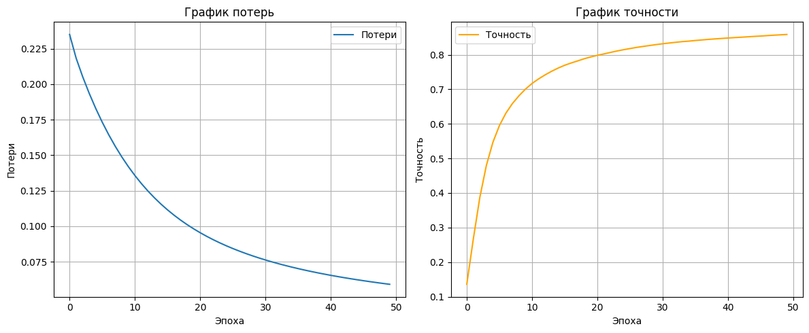

# Описание проекта
Этот репозиторий содержит реализацию нейронной сети для классификации рукописных цифр из набора данных MNIST. Проект состоит из двух частей:

1) Обучение модели: Jupyter-ноутбук, реализующий нейронную сеть с нуля (без использования ML-фреймворков) с использованием NumPy.
   * Архитектура: один скрытый слой (512 нейронов, текущая реализация позволяет использовать несколько слоев) с активацией ReLU и выходной слой с активацией Softmax.
   * Особенности: инициализация весов по методу Xavier, оптимизация через градиентный спуск, разделение данных на тренировочный/валидационный наборы.

2) Классификатор изображений: Скрипт для предсказания цифр на пользовательских изображениях с использованием обученных весов.

# Установка зависимостей
Убедитесь, что у вас установлен Python 3.7 или выше.
Установите зависимости:

```bash
pip install numpy keras opencv-python
```

### Классификация изображений
Запустите скрипт, указав путь к изображению:
```bash
python main.py path/to/your/image.png
```

Опции:
* `--probs`: Вывести вероятности для всех классов (по умолчанию выводится только предсказанный класс).

### **Требования к изображению**:
* Формат: PNG, JPG, BMP.
* Рекомендуемый размер: 28x28 пикселей (скрипт автоматически изменит размер).

# Результаты обучения

**Параметры обучения:**
* Скрытый слой: 512 нейронов.
* Learning rate: 0.1.
* Количество эпох: 50.

### Метрики:

На валидационном наборе модель достигает точности `~0.92%` после 50 эпох.



